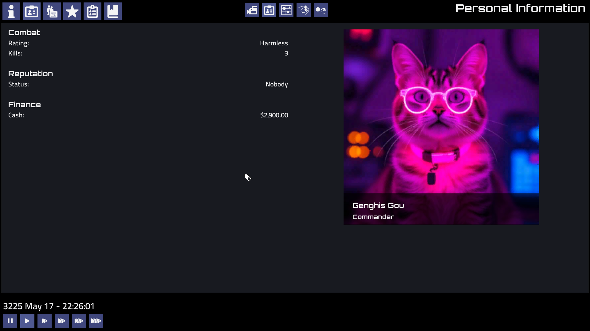

# Pioneer.eapi.space

Welcome to Pioneer. We hope this mod brings joy to your life.

### Actions

install pioneer
```shell
echo "installing dependencies for pioneer"
sudo apt install libsdl2-image-dev
sudo apt install libassimp-dev
sudo apt install libsigc++-2.0-dev
sudo apt install libvorbis-dev
sudo apt install libfreetype-dev
sudo apt install git


mkdir -p ~/git
cd ~/git

git clone https://github.com/syonfox/pioneer.git

cd pioneer 

./bootstap.sh
make clean
make -j8

```

install mod
```shell
wget https://github.com/syonfox/eapi-space/archive/refs/heads/main.zip
wget https://codeload.github.com/syonfox/eapi-space/zip/refs/heads/main -o main.zip
unzip eapi-space-main.zip
cp eapi-space-main ~/.pioneer/mods/eapi-space

#or with git
cd ~/.pioneer/mods/
git clone https://github.com/syonfox/eapi-space.git
```

enjoy

### Sauces

https://foxi.eapi.space

https://github.com/pioneerspacesim/pioneer


### Writing a mod guide. 

So I'll assume you have compiled pioneer from scratch and looked at the files a little. 

Now where do you start? 

Find your mod directory as per os https://wiki.pioneerspacesim.net/wiki/Mods

`LINUX_PIONEER_MOD_DIR=~/.pioneer/mods` henceforth the `<mods>` dir

Also, just in general read the wiki: ... maybe start here https://wiki.pioneerspacesim.net/wiki/Introduction_to_Mission_Scripting


So then what do you need to know.  mods are in lua .. learn lua ;)

Every folder or zip in the `<mods>` folder will be merged with the pioneer data folder.  

Zip will take priority over a folder.

`~/.pioneer/config.ini`
```
[ModLoader]
eapi-space=0
honk=disabled
```
Above is an example of disabling a mod and adjusting the order of mod loading with the index. in the config.

Configure with(https://foxi.eapi.space/local_mod)

Demo facegen + honk mod 
```sh
cd ./pioneer ;
mkdir -p mods ;
cd mods ;
wget https://github.com/syonfox/eapi-space/raw/refs/heads/main/_dev/cat-face.zip
wget https://github.com/syonfox/eapi-space/raw/refs/heads/main/_dev/honk.zip
```




you can patch language files as per https://github.com/pioneerspacesim/pioneer/issues/5996#event-15861212915

Systems DO NOT override generated systems or partial systems so create new systems or update a partial system by overriding the
def file in <mods>/systems/partials/???.lua (todo: fix this)

Tip. You can add a real star to the game and then override this in your mod. (but not generated so ensure you place these at non generated locations.)


# Why mod?  

So that you can play around with the systems, ships, etc without git conflict.

# Why not mod? 

because you need core cpp features.  Add these to the game
